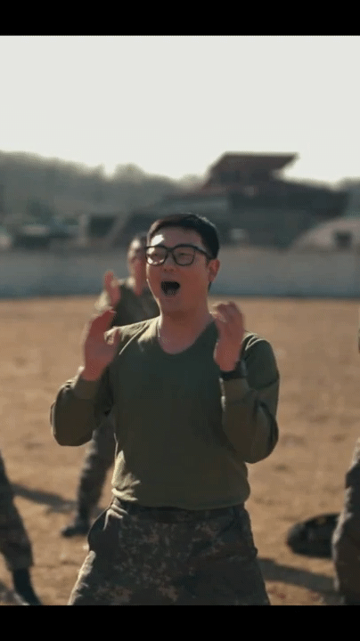

# AI 숏폼 제작 자동화 프로그램

## 팀 멤버
|  |  |  |  |
|:----------------------------------------------------------------------------------------------------:|:-------------------------------------------------------------------------------:|:---------------------------------------------------------------------------------:|:---------------------------------------------------------------------:|
| **서영현** | **이예림** | **전홍석** | **정재원** |

## 데모 영상

## Step 1: Shot Detection & Face Recognition

**Output 1 - Shot & Face Detection**

**Output 2 - Shot & Face Detection**

## Step 2: Main Character Selection

**Output 1 - Main Character Selection**

**Output 2 - Main Character Selection**

## Step 3: Face Tracking

Face Tracking 알고리즘 개발 결과를 보여주는 영상입니다.

**Output 1 - Face Tracking**

**Output 2 - Face Tracking**

## Step 4: Stable Cropping

Stable Cropping 알고리즘 개발 결과를 보여주는 영상입니다.

**Output 1 - Stable Cropping**

**Output 2 - Stable Cropping**

## git

### branch 전략

1. **master(main)** 브랜치에서 **develop** 브랜치 생성
2. **master(main)**와 **develop** 브랜치는 **항상 운영**되며 삭제하는 브랜치가 아님! 
3. 새로운 기능 추가가 있는 경우 **develop** 브랜치에서 **feature** 브랜치 생성하기
4. 기능 추가 완료 시 **feature** 브랜치는 **develop** 브랜치로 **merge** 하기
5. 모든 기능들이 완료되면 **develop** 브랜치에서 **release** 브랜치 생성하여 release 브랜치에서 QA 테스트하고, 버그픽스하기
6. QA 테스트가 완료되면 **master**와 **develop** 브랜치에 둘 다 **merge** 
7. master 브랜치에 merge가 완료되면 버전태그 추가

### commit 방법

- [날짜] subject
ex) [Day1] Face Detection 모델 구현
